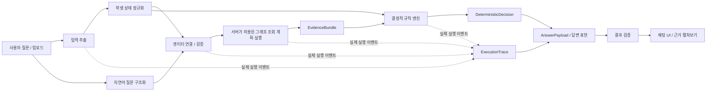

# 설계 아키텍처와 컴퓨터공학과 검증 흐름

## 현재 구현 선택 (2026-10-01, Core v3 데이터 보강)

첫 vertical slice는 Docker 엔진 없이 재현 가능한 Python 3.12·SQLite 속성 그래프를 사용한다. 그래프는 PDF에서 확인한 편성 사실·요건과 출처를 저장하며, 허용된 `FETCH_CATALOG_ENTRY`·`FETCH_REQUIREMENTS`·`FETCH_POLICY_FACTS`를 실행한다. Python 규칙 엔진이 학생 실제 이수·가상 추가 이수에 대해 별도의 결정적 판정을 만든다. `verifier.py`는 그래프 반환 관계, 규칙 입력, 판정 해시, 답변 데이터, 실제 실행 이벤트의 일치를 출력 전에 검사한다. 2026 컴퓨터공학과 전공 43행과 교양 280행을 출처와 연결해 적재했다. `GEA8617`은 PDF 내부의 코드 충돌을 원자료의 `known_conflicts`에 보존하며 카탈로그 적재와 확정 인정에서 제외한다. 2006–2025 학점표는 연도별 정책 사실 조회에만 사용한다.

## 경계와 처리 순서

이 문서의 2단계 walkthrough는 설계 당시의 검증 기록이다. 현재는 SQLite 그래프 적재·허용 조회·로컬 LLM 연결·채팅 화면이 구현되어 있다. 교육과정 사실은 원문 PDF와 1단계 인벤토리·출처 색인의 확인 상태를 따르며, 평가 전용 자료는 사실/규칙/조회 입력 경로에서 제외한다.

사용자 질문/업로드 → 입력 추출 → 학생 상태 정규화 → 자연어 질문 구조화 → 엔티티 연결/검증 → 허용된 그래프 조회 → 규칙 엔진 → `DeterministicDecision` → 누적된 `ExecutionTrace` 확정 → 답변 표현 → 결과 검증 → 채팅 UI/근거 펼쳐보기 순서로 결과를 공개한다. 질문 구조화는 학생 상태 정규화와 독립적으로 진행할 수 있으나, 검증된 조회 전에 두 결과를 합친다.

| 단계 | 담당 | 출력·검증 |
| --- | --- | --- |
| 입력 추출·상태 정규화 | 결정적 파서/OCR·검증 코드와 필요한 사용자 확인 | 이미지/PDF/HWP/DOCX의 **후보**를 `StudentState`로 정규화. 추출 신뢰·누락 학기·학생 증거를 표시하며 추측해서 학점 인정하지 않음. |
| 자연어 질문 구조화 | 결정적 해석 우선 + 검증된 **로컬 LLM 보조** | 의도·언급 후보·시나리오 요청만 `StructuredQuery`로 출력. 규칙, 학점, 졸업 여부, Cypher를 만들지 않음. |
| 엔티티 연결/검증·조회 | 결정적 서버 코드; 향후 그래프 어댑터 | 과목/학과/적용연도 ID를 검증하고 allowlist `QueryPlan` 생성. 실제 반환된 사실·관계·출처만 `EvidenceBundle`에 포함. |
| 규칙 엔진·판정 | 결정적 코드 | `RuleEngineInput`과 검증된 IR로 `CreditRecognition`, 요건별 결과, `DeterministicDecision` 계산. 적용 범위·누락·충돌을 상태로 전달. |
| 실행 기록 | 각 실제 단계의 코드 | 조회·반환 관계·계산 입력/결과의 논리 순서를 `ExecutionTrace`에 기록. DB의 물리 탐색 순서나 숨은 추론을 생성하지 않음. |
| 답변 표현·검증 | **로컬 LLM의 출력 역할** 후 서버 검증 | LLM은 잠긴 `AnswerPayload`를 한국어로 표현. 서버가 모든 수치·상태·출처를 비교해 불일치 시 결정적 템플릿 사용. UI는 검증된 답변과 실제 trace만 표시. |

## 2026 컴퓨터공학과 첫 vertical slice: 구조 walkthrough

아래는 **PDF로 확인된 참조 사실을 모델에 흘려보는 설계 검증**이다. 실제 학생 이수기록이나 가상 정답을 만들지 않았다.

| 질문 형태 | 객체 → 관계 → 규칙 → 결과 계약 | 부족하면 어떻게 되는가 |
| --- | --- | --- |
| `CDA0143`의 학점·이수구분은? | `Course(CDA0143)` → 2026 `CatalogEntry` → 컴퓨터공학과 `전공필수`, 3학점 관계(PDF 262) → 요건 규칙 없이 `lookup_result={2026,3,MAJOR_REQUIRED,source}`. 학생의 인정학점 주장은 아님. | 과목만 언급하고 적용 편성연도가 필요한 맥락이면 연도를 확인. 과거 학생에게 2026 분류를 자동 적용하지 않음. |
| 지금까지 전공학점은? | `StudentState`의 실제 완료 시도 → 학점/과목표 적용 `CurriculumApplicability` → 공식 동일·재수강 처리 → 분류 및 `CreditRecognition` → `MIN_CREDITS` 비교. 2026 컴퓨터공 주전공의 전필21·전선24·심화33은 PDF 261·577. | 학생 성적표·적용연도·전체 학기 범위가 없으면 합계는 `null`과 `NEEDS_INFORMATION`; PDF의 21/24는 **요구값**이지 취득값이 아님. |
| 남은 전공필수는? | 2026 `RequirementGroup` → 과목표의 전필 7개 3학점 행과 0학점 `CDA0034 졸업논문`·`CDA0088 심층상담`(PDF 262–263) → 실제 이수/승인된 대체와 `REQUIRED_COURSES`, `EXEMPTION` 비교 → `missing_courses`. | 완료 기록 범위가 불완전하거나 과거 적용자/동일·대체 지정이 미확인이면 목록 `null`. PDF 264의 심층상담 경과조치 조건을 먼저 검사. |
| `CDA0163`을 추가로 이수하면? | PDF 262의 2026 전공선택 3학점 `CatalogEntry` → **별도** `ScenarioDelta` → 기존 시도·중복·적용 버전 확인 후 `CreditRecognition` 재계산 → 관련 요건의 실제/가상 결과 차이. | 학생의 기존 이수·동일/대체 상태가 없으면 “3학점 증가”나 졸업 변화로 확정하지 않음. 원본 실제 기록은 변하지 않는다. |

이 네 흐름은 같은 과목의 편성 학점과 학생의 인정학점을 구분하고, 0학점 필수·연도별 적용·가상 추가를 표현할 수 있다. PDF 14의 동일/대체 처리와 PDF 33의 교양 상한, PDF 476–477의 다전공 중복은 같은 `CreditRecognition` 계산 단계에 조건부로 들어간다. 실제 지정 목록과 학생별 증거가 없으면 그 경로는 `NEEDS_INFORMATION`이다.

## 2단계 완료 점검과 다음 구현 경계

| 완료 조건 | 설계상 확인 위치 |
| --- | --- |
| 사실/규칙 분리, 실제/가상 분리 | `ontology_model.md`의 `CatalogEntry`·`CourseAttempt`·`CreditRecognition`·`ScenarioDelta`; `rule_model.md`의 IR |
| 적용 교육과정, 미확인 안전 처리 | 영역별 `CurriculumApplicability`, 출처 상태 4종, 정보 부족 전파·명시적 경과조치 |
| LLM 없는 결정적 판정 계약 | `data_contracts.md`의 `RuleEngineInput`→`DeterministicDecision`, 규칙 세트/입력 해시 |
| 답변에서 원문까지 추적 | `provenance_model.md`의 `decision_id`→실제 규칙/사실/관계→PDF 페이지·표·각주 또는 학생 증거 |
| 자유 Cypher·LLM 졸업판정 차단 | 서버 생성 `QueryPlan` allowlist, 읽기 전용 `AnswerPayload`, 결과 대조/템플릿 대체 |
| 첫 vertical slice 표현 | 위 4개 walkthrough와 PDF 262–263, 261·577의 컴퓨터공학과 값 |

3단계의 첫 vertical slice는 구현·검증됐다. 과거 과목별 필수 목록, 공식 동일/대체 지정, 제2전공의 학생별 적용 자료, 실제 학생의 이수·논문·인증 증빙은 여전히 별도 확인이 필요하다.

## 구현된 정책 조회 경로

원문 기준 자체를 묻는 한국어 질문은 `POLICY_LOOKUP`과 허용 주제로 구조화한다. 서버가 `FETCH_REQUIREMENTS`·`FETCH_POLICY_FACTS`·필요 시 `FETCH_CATALOG_ENTRY`를 계획하고 실제 SQLite 그래프 관계를 읽는다. 서버 소유 렌더러는 조회된 값과 PDF 위치만 한국어로 표현한다. 이 경로는 학생 이수학점 계산이나 졸업판정을 실행하지 않으며, 로컬 LLM의 자유 정책값 생성은 받지 않는다. 개인 학점·남은 요건·가상 이수 질문은 기존 결정적 Rule Engine 경로에 남긴다.

## 공식 문서집합과 RuleSet 버전 경로

`build_catalog.py`는 확인된 교육과정 PDF의 SHA-256과 원문 locator에서 최초 문서집합 v1·RuleSet v1을 만든다. 현재 활성 버전은 **ADS-CE-2026-CORE v1 / CRS-CE-2026-CORE v3**다. v2는 같은 PDF 33쪽의 정책 사실 두 건을 보강했다. v3는 교양 편성학기 원문 셀 280개를 보강하고 19개 실행 규칙·323개 과목·정책 사실·적용 범위를 유지한다. v1/v2는 불변 스냅샷으로 보존한다. `RuleSetStore`는 불변 카탈로그 스냅샷과 활성 버전 포인터를 관리한다. 서버와 CLI 데모는 활성 스냅샷을 읽고 `QUERY_PLAN`·Decision·ExecutionTrace에 문서집합/RuleSet 버전을 기록한다. 학생별 적용 Rule ID는 검증된 범위 조건으로 좁힌다. 펼쳐보기 화면은 적용 문서·RuleSet·규칙 출처·미해결 충돌을 이 실행 결과에서 표시한다.

새 공식 문서 경로는 `파일 → 추출·해시 → 문서 유형·공식성 검토 대기 → 관련 규칙 후보 탐색 → 검토자가 문서 관계/원문 위치/변경을 확정 → 새 문서집합 및 RuleSet 스냅샷 발행 → 서버 재시작 후 새 판정`이다. 추출 단계는 규칙을 바꾸지 않는다. `SUPPLEMENTS/CLARIFIES/OVERRIDES/CONFLICTS_WITH`는 검증된 관계와 출처가 있어야 발행된다. 이전 스냅샷은 남아 같은 학생 입력으로 재실행할 수 있고, `compare_decisions`가 두 버전의 규칙·요건·결론 차이를 계산한다. 미해결 충돌의 범위가 학생과 겹치면 졸업 결론은 `UNKNOWN`이다.
## 남은 요건·과목 후보 경로 (2026 Core)

한국어 질문은 서버의 허용된 `REMAINING_PLAN`과 영역 필터로 구조화된다. 실제 StudentState와 서버 시작 시 선택한 활성 `CRS-CE-2026-CORE v3`로 먼저 기존 Rule Engine의 `RequirementResult`를 계산한다. 서버가 VERIFIED 편성행을 `FETCH_CATALOG_SET`으로, 미충족 요건의 `SATISFIES` 간선을 `FETCH_COURSE_REQUIREMENT_LINKS`로 조회한다. `RemainingRequirementSummary`는 실행된 요건 결과를 투영하고 `CandidateCourse`는 조회된 간선과 실제 인정 과목을 대조해 분류한다. 결정·근거·실행 이벤트를 같은 스냅샷에 고정한 뒤 서버 템플릿으로 답한다. 로컬 LLM은 판정이나 과목 선택을 바꿀 수 없다. 가상 추가 이수는 기존 별도 `WHAT_IF` 경로를 사용한다. 학년 메타데이터,미확인 개설/선수과목 정보는 요건 계산에 들어가지 않는다.

학생용 표시에서는 기존 결정과 후보를 바꾸지 않고 `remaining_presentation`으로 전공/교양 및 연결된 미충족 Rule별 후보 수를 계산한다. 기본 채팅 답변은 현재 상태, 필수, 부족 학점, 후보 수, 미확인 사항을 구분한다. 전체 후보는 펼쳐보기에서 요청할 때만 화면에 채우며 각 행의 실제 `SATISFIES` 관계, Rule 출처, PDF 페이지를 보여준다. 표시 투영은 서버 verifier가 원래 `DeterministicDecision`과 대조한다.

## 정책 질문과 개인 판정의 분기

서버는 학생 상태 없이도 `POLICY_LOOKUP`을 허용하고 허용된 `Requirement`·`PolicyFact`·편성 과목 조회를 수행한다. 개인 이수값이 없는 복합 질문은 확인된 정책 결과를 먼저 반환하고 개인 계산만 `NEEDS_INFORMATION`으로 표시한다. 정책 합산·잔여·상한 연산은 서버의 결정적 계산기와 `ExecutionTrace`에서 수행하며, LLM은 수치나 적용 대상을 만들 수 없다. 현재 활성 RuleSet v3는 v2의 정책 사실과 규칙을 그대로 보존한다. 공식 대체 지정 목록, 최종 승인 기록, 2026 상담 의무 횟수와 과거 전체 RuleSet은 별도 공식 자료가 없으므로 확정하지 않는다.

## 페이지 안의 채팅 상태 (2026-10-01)

프론트는 기존 단일 HTML과 `/api/query`, `/api/extract`, `/api/normalize-upload`, `/curriculum.pdf` 경로를 유지한다. `ChatSession`은 적용 StudentState, 업로드 pending, context, 요청 revision을 분리한다. 업로드의 추출·정규화는 검토 후보만 만들고 명시적 적용에서 현재 학생을 교체한다. 각 답변은 요청 당시 학생 복사본과 반환 AnswerPayload·ExecutionTrace에 고정된다. 늦은 응답은 revision/generation 검사로 차단한다. 서버의 판정·규칙·해석 계약은 변경하지 않았다.

대화는 현재 페이지의 메모리에서만 유지하며 새로고침은 빈 상태로 시작한다. 세부 상태·초기화 범위·근거 표시 계약은 [채팅 UI 설계](chat_session_ui.md)에 있다.

## 편성정보 조회·표시 (v3)

남은 요건과 정책 조회에서 위에 기술한 v2는 기능의 도입 버전이다. 현재 실행은 v2의 모든 규칙·정책을 보존한 v3를 사용한다.

공식 편성표 → 보존된 CatalogEntry 원문 → `normalize_placement` → `PLACEMENT_LOOKUP`의 허용 조회 → 결정적 학년/학기 필터·묶음 → EvidenceBundle·`PLACEMENT_SELECTION` → 서버 답변·UI 순서다. 개인 후보는 기존 남은 요건 계산 이후 별도의 `placement_view`에서 교집합을 구하며 기존 판정값을 바꾸지 않는다. 과거 학번이 입력된 경우에도 일반 편성 질문은 현재 **2026 카탈로그**를 명시해 안내할 수 있지만 그 학생의 인정/졸업 기준으로 적용하지 않는다. 실제 개설과 수강 가능은 별도 미확인 상태다. 세부 계약·원문 검증·미해석 셀은 [편성정보 설계](curriculum_placement.md)에 있다.
